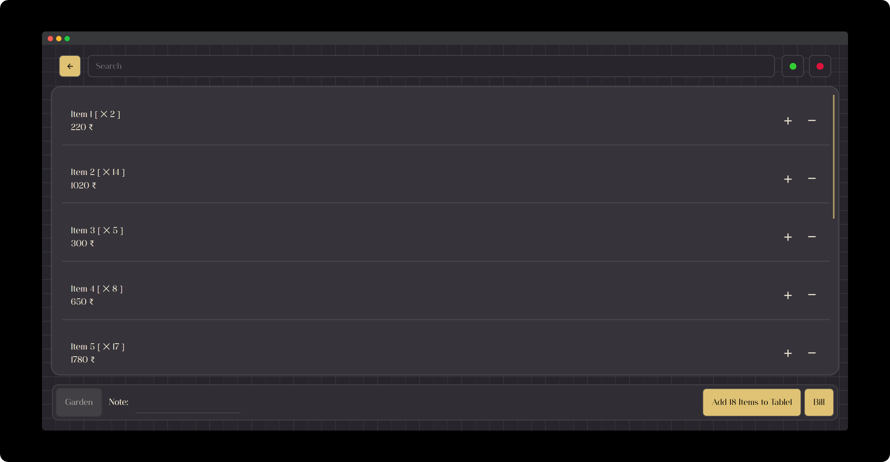

# [Restro/Hotel Management Website](https://praashoo7.github.io/Figma-Front-End/)

While learning Figma, I Designed a Restro/Hotel Management Website for a friend's Project. Afterwards, I developed the front-end for it. This is just the Front-End code. You can navigate through the Webpages by just pressing dummy buttons From this [Site Link.](https://praashoo7.github.io/Figma-Front-End/) You can see the Screenshot of the Pages below. 

If you prefer single CSS and JS files instead of separate ones for each page, you can find them [here.](https://github.com/Praashoo7/Figma-Front-End/tree/main/SINGLE-CSS-JS)  

## Figma Link

- [Figma](https://www.figma.com/file/QuajVMh3wftRJoL2ydSVhd/Untitled?type=design&node-id=0%3A1&mode=design&t=aDzQbuhSTRbYdBDx-1)  

## Light Mode

  

## Dark Mode

  

## Pages
- Login-Page [Link](https://praashoo7.github.io/Figma-Front-End/index.html) 
- Home-Page [Link](https://praashoo7.github.io/Figma-Front-End/HomePage.html) 
- AddItems-Page [Link](https://praashoo7.github.io/Figma-Front-End/AddItemsPage.html) 
- Billing-Page [Link](https://praashoo7.github.io/Figma-Front-End/Billing.html) 
- Sales-Page [Link](https://praashoo7.github.io/Figma-Front-End/Sales.html)  

## Credits

- Fonts
  - Aesthetic Font from [FontSpace](https://www.fontspace.com/aesthetic-font-f76813) by Nirmana Visual.
  - Brownhill Script Font from [FontSpace](https://www.fontspace.com/brownhill-script-font-f46547) by sizimon.
  - Classy Vogue Font from [FontSpace](https://www.fontspace.com/classy-vogue-font-f76295) by variatype.

- SVGS are from [SVG Repo.](https://www.svgrepo.com/)
- Login Image is from [Unsplash](https://unsplash.com/) by Sehajpal Singh.
- Background texture is from [Transparent Textures.](https://www.transparenttextures.com/) 
- Chart from [AMCHARTS.](https://www.amcharts.com/)  

## License

Figma-Front-End is open-source Software Licensed under the [MIT License](https://github.com/Praashoo7/Figma-Front-End/blob/main/LICENSE)
