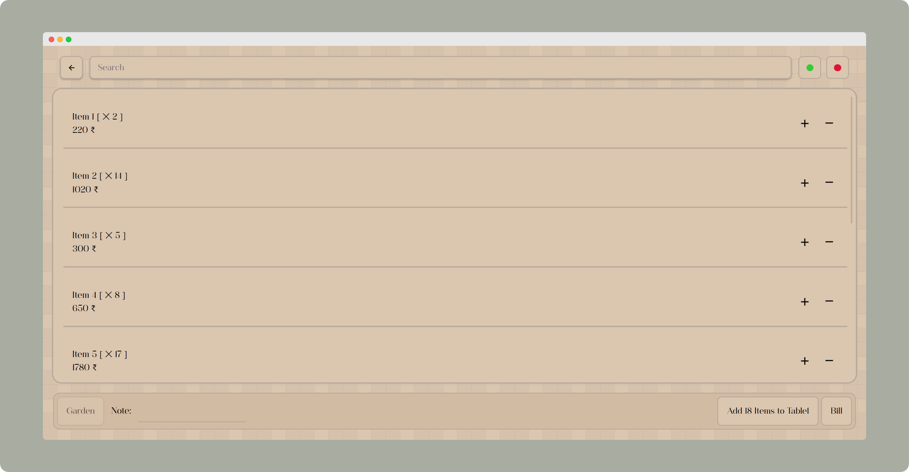
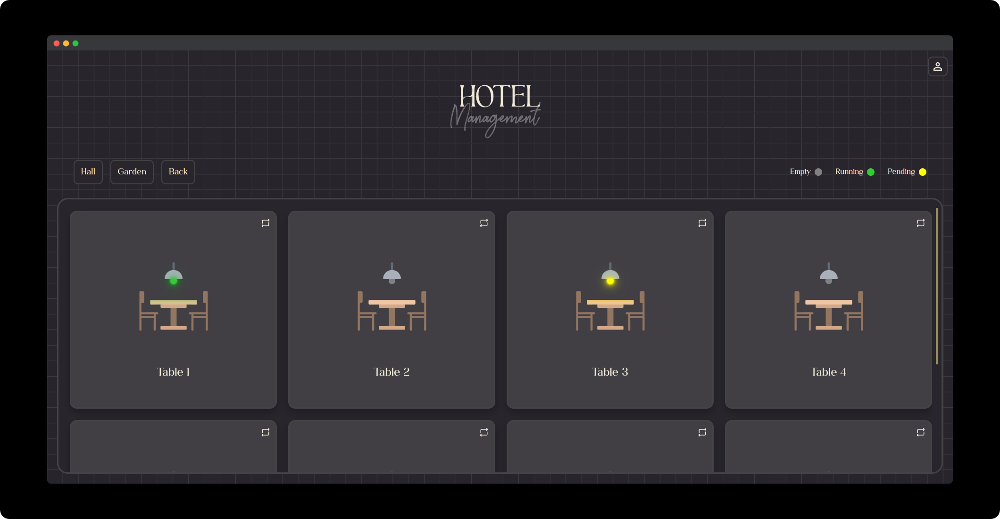
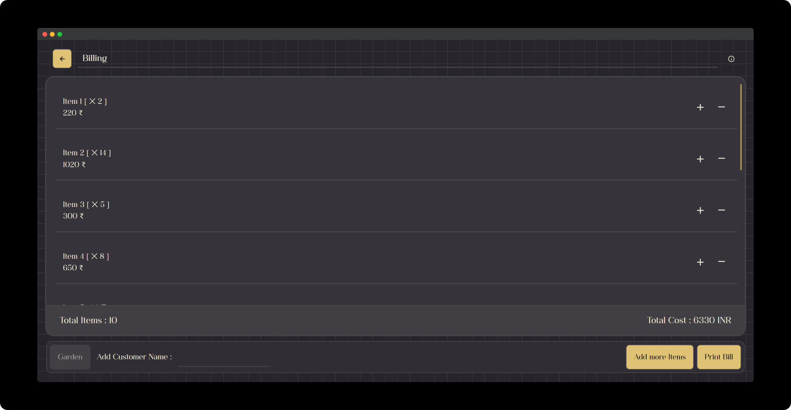

# [Restro/Hotel Management Website](https://praashoo7.github.io/Photo-Gallery-React/)

While learning Figma, I created a Design for a Restro/Hotel Management Website for a Project. And then did the Front-End for it. This is just the Front-End code. You can navigate through the Webpages by just pressing Buttons From this [Site Link.](https://praashoo7.github.io/Photo-Gallery-React/) You can see the Screenshot of the Pages below. 

CSS and JS folder have separate CSS-JS files in them for each page. If you want single CSS-JS files you can find them [here.](https://praashoo7.github.io/Photo-Gallery-React/)  

## Figma Link

[Restro/Hotel Management Website Figma](https://unsplash.com/)  

## Light Mode

  

## Dark Mode

 

## Separate Page Links
- Login-Page [Link](https://praashoo7.github.io/Photo-Gallery-React/) 
- Home-Page [Link](https://praashoo7.github.io/Photo-Gallery-React/) 
- AddItems-Page [Link](https://praashoo7.github.io/Photo-Gallery-React/) 
- Billing-Page [Link](https://praashoo7.github.io/Photo-Gallery-React/) 
- Sales-Page [Link](https://praashoo7.github.io/Photo-Gallery-React/)  

## License

