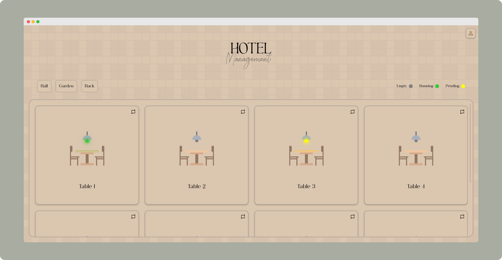
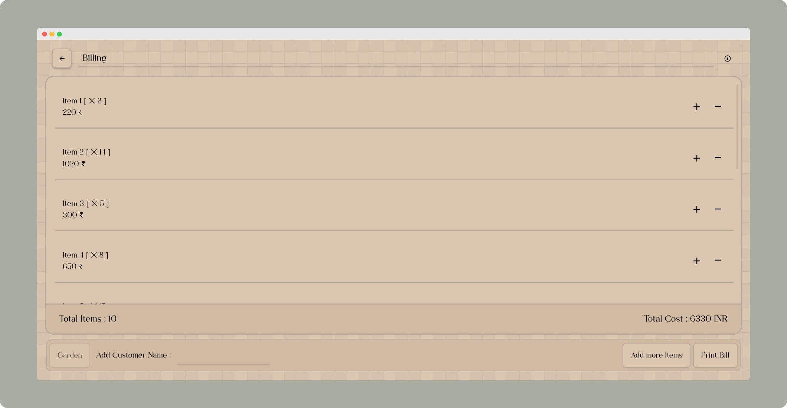

# [Restro/Hotel Management Website](https://praashoo7.github.io/Photo-Gallery-React/)

While learning Figma, I created a Design for a Restro/Hotel Management Website for a Project. And then did the Front-End work for it. Below are Screenshot of the Pages. 

## Light Mode

  

## Dark Mode

 

Here is the [Figma Link](https://unsplash.com/)  

## License

